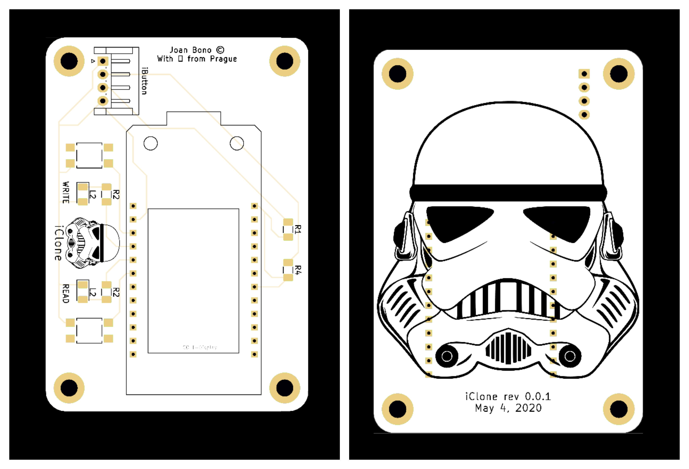
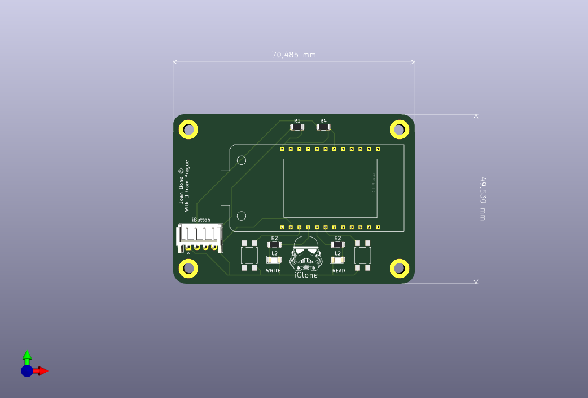
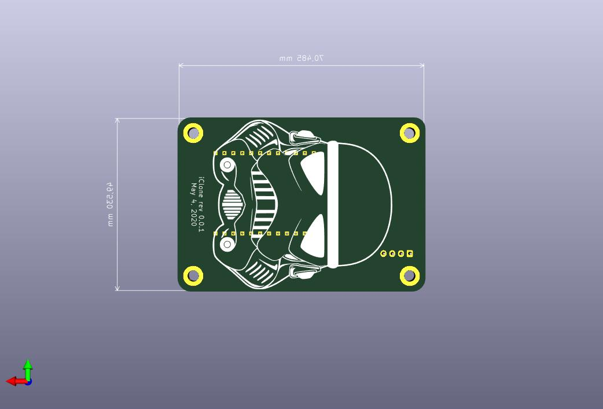

# iClone

iButton cloner based on ESP32 TTGO Board

## rev 0.0.1

Features:
+ Integrated LCD display
+ Read/Write buttons
+ iButton Probe over OneWire

## Parts

+ ESP32 TTGO T-Display (https://www.aliexpress.com/item/4000606780227.html)
+ Resitors SMD 1206 (https://www.aliexpress.com/item/32774150552.html)
+ Led SMD 1206 (https://www.aliexpress.com/item/4000160742329.html)
+ iButton Probe (https://www.aliexpress.com/item/32357830921.html)
+ Push button SMD (https://www.aliexpress.com/item/32912247205.html)
+ 4 Pin JST Connector (https://www.aliexpress.com/item/4000078458794.html)
+ M3 screws and spacers (https://www.aliexpress.com/item/4000848851555.html)

*** 

### Screenshots

#### Front view

#### Back view

***

## References

+ [ESP32 TTGO T-Display Pinout](img/TTGO_pinout.png)
+ [ESP32 TTGO T-Display KiCad Lib](MODULE_TTGO_T-DISPLAY_KiCAD.zip)
+ [ESP32 TTGO T-Display Eagle Lib](TTGO.T-Display_EAGLE.lbr.zip)
+ https://github.com/Xinyuan-LilyGO/TTGO-T-Display
+ https://github.com/Xinyuan-LilyGO/TTGO-T-Display/issues/28
+ https://www.instructables.com/id/The-iButton-garage-door-opener-Arduino/
+ https://github.com/AlexMalov/EasyKeyDublicator